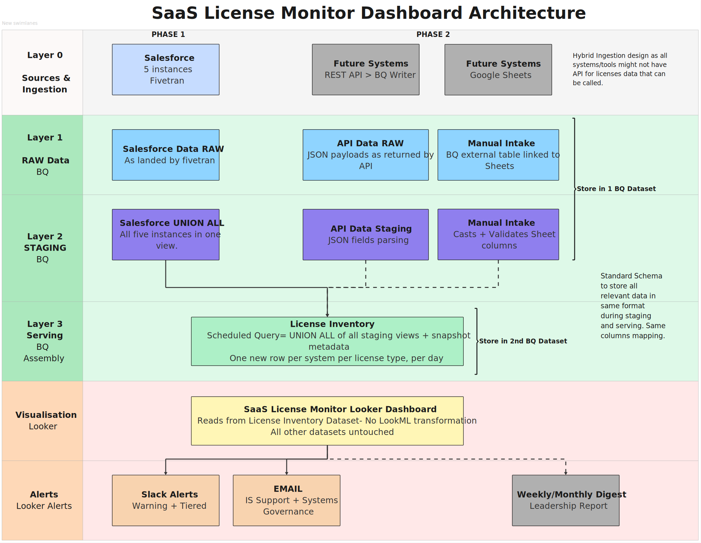

# SaaS License Monitor

A centralized license capacity monitoring pipeline built on BigQuery, Fivetran, and Looker — designed and built solo as an internal tool at a publicly traded SaaS company. Replaced a fully manual, per-tool process that only surfaced license shortages after they had already blocked user provisioning.

**Stack:** BigQuery · Fivetran · Looker · GCP · SQL · LookML  
**Role:** Sole designer and builder — architecture, SQL, LookML, alerting, documentation  
**Status:** Phase 1 live. Phase 2 designed and documented.
**Demo:** [mahdeen-reza.github.io/saas-license-monitor](https://mahdeen-reza.github.io/saas-license-monitor/)

---

## The Problem

Before this project, checking license capacity meant logging into each SaaS tool individually — different interface, different reporting format, no consistent cadence. Staying current required constant context switching across systems with no central view to anchor it.

The absence of alerting meant shortages only surfaced when a new hire couldn't be provisioned. At that point, the remediation path — identifying removable users, requesting additional licenses, waiting on vendor processing — added days of delay to onboarding. There was no utilization history, no trend data, and no data foundation for renewal conversations. Every shortage was reactive. Every incident was avoidable.

---

## What This Does

Ingests license data from SaaS tools via Fivetran, transforms it through a standardized staging layer in BigQuery, assembles it into a daily-append serving table, and surfaces it in a Looker dashboard with automated Slack and email alerting. Shortages are flagged before they affect anyone.

Phase 1 covers five Salesforce instances. Phase 2 extends the same pipeline to any SaaS tool — regardless of whether it exposes an API — using a hybrid ingestion model designed into the architecture from the start.

---

## Architecture



The pipeline runs in four layers:

**Layer 0 — Ingestion.** Fivetran syncs raw Salesforce data every 40 minutes into raw BigQuery datasets. Data lands exactly as the source produced it — no transformation at this layer.

**Layer 1 — Raw.** Raw datasets sit in a single BQ dataset, one per source system. This layer is never queried by the dashboard.

**Layer 2 — Staging.** SQL views transform raw data into a standard 8-column schema. Each view is fully self-contained — a change to one source system touches only its staging view and nothing else in the pipeline. All five Salesforce instances are combined into a single `stg_salesforce` view via `UNION ALL`.

**Layer 3 — Serving.** A daily scheduled query runs at 06:00 UTC, assembles all staging views via `UNION ALL`, and appends a new snapshot to the `license_inventory` serving table. Looker reads exclusively from this table. Pre-computed utilization percentages are stored here so dashboard load performance stays fast at scale.

---

## Key Design Decisions

**Isolation principle.** Each staging view is fully self-contained. When a source system changes its schema or a new instance is added, only that view is updated — the serving table, LookML model, and dashboard are never touched. This is the core architectural decision that makes the pipeline maintainable by a small team.

**Staging contract.** All staging views output an identical 8-column schema regardless of source. The serving layer is source-agnostic by design — adding a new system in Phase 2 requires writing one staging view and uncommenting one line in the assembly query. See [`docs/staging_contract.md`](docs/staging_contract.md) for the full schema specification.

**Append-only serving table with idempotency guard.** Every scheduled query run appends a new daily snapshot, preserving full history for trend analysis. A `DELETE WHERE snapshot_date = CURRENT_DATE()` guard runs before every insert, making manual reruns safe with no duplicate risk.

**Pure SQL, no dbt.** A deliberate choice to keep the stack lightweight and maintainable without additional tooling overhead. Any analyst familiar with BigQuery SQL can read, modify, and extend this pipeline without learning a new framework.

**Utilization % pre-computed at assembly time.** `SAFE_DIVIDE(used_licenses, total_licenses) * 100` is calculated in the assembly query and stored in the serving table, not computed in LookML on every dashboard load. Prevents division-by-zero errors and keeps query performance consistent as the dataset grows.

---

## Phase 1 — Salesforce (5 Instances)

Five Salesforce instances are connected, each with different data availability through Fivetran.

Four instances expose a `user_license` table directly — the staging view reads aggregated counts, renames columns to match the contract schema, and filters to active license types only.

One instance (Instance C) does not expose a `user_license` table through Fivetran. License counts are reconstructed by querying the raw `user` table directly: active users are filtered, their `user_type` fields are mapped to human-readable license categories, and totals are hardcoded from the contract — including a `-2` adjustment for system/admin accounts that hold licenses but are not real provisioned users. This reconstruction logic is instance-specific and fully documented in the staging view.

---

## Phase 2 — Extensible Ingestion (Designed)

The Phase 2 architecture extends the pipeline to any IS-managed SaaS tool using three ingestion patterns, chosen based on what each tool exposes:

- **REST API** → Cloud Function polling daily, writing JSON payloads to a raw BQ dataset
- **Google Sheets manual intake** → BigQuery External Table linked to a maintained Sheet
- **Admin UI scraper** → Cloud Run job using Playwright, used only when no API or sheet option exists

In all three cases, the new system's data lands in the raw layer, a new staging view is written to conform to the staging contract, and one line is uncommented in the assembly query. The serving table, LookML model, and dashboard require no changes. Phase 2 infrastructure is designed; build is pending prioritization.

---

## Dashboard and Alerting

The Looker dashboard reads exclusively from the `license_inventory` serving table. No transformations happen in LookML — all calculation and aggregation logic lives in SQL.

Three dashboard sections:

- **Health summary** — single-value tiles for total, used, and available licenses across all systems; count of systems at critical or warning threshold; data quality issue flags
- **System detail** — utilization bar chart per system; full license breakdown table with conditional formatting driven by `alert_status`; available licenses by license type
- **Trend** — available licenses over time; utilization trend by system

Alert thresholds are defined in the LookML `alert_status` dimension and evaluated daily at 06:30 UTC:

- **Critical** (< 5 available seats) → Slack alert to all IS admins + email
- **Warning** (< 10 available seats) → Slack alert to IS team lead
- **Weekly digest** → PDF report to IT management and VP, delivered Monday 08:00

---

## Impact

| | Before | After |
|---|---|---|
| How shortages were discovered | User couldn't be provisioned | Slack alert at 06:30 UTC before anyone is affected |
| Capacity check process | Manual, per-system, no consistent cadence | Single dashboard, all systems, updated daily |
| Trend visibility | None | 3 years of daily snapshots retained |
| Renewal planning basis | Anecdotal | Data-driven utilization history per system |
| Alerting | None | Automated, threshold-based, tiered by severity |
| License logic documentation | Tacit knowledge | Encoded in SQL, versioned, editable |

**Key numbers:**

- 5 Salesforce instances connected in Phase 1
- ~15–20 license types tracked across instances
- Fivetran sync every 40 minutes
- Dashboard refreshes daily at 06:00 UTC
- 3-year partition retention on the serving table

---

## Repository Structure

```
saas-license-monitor/
│
├── README.md                          ← this file
│
├── sql/
│   ├── stg_salesforce.sql             ← combined staging view for all 5 SF instances
│   └── assembly_query.sql             ← daily scheduled query; assembles serving table
│
├── lookml/
│   ├── license_inventory.view.lkml    ← all dimensions, measures, and alert logic
│   └── is_license_model.model.lkml   ← Explore definition and always_filter
│
├── architecture/
│   └── pipeline_architecture.svg      ← full pipeline diagram (Phase 1 + Phase 2)
│
└── docs/
    └── staging_contract.md            ← 8-column schema all staging views must conform to
```

---

## A Note on This Repository

This is a sanitized portfolio version of an internal production tool. Company name, instance names, internal identifiers, and colleague references have been abstracted or removed. The pipeline architecture, SQL logic, LookML modeling, and design decisions are real and reflect the actual system as built.

---

## Live Demo

A static portfolio mock of the dashboard is deployed at **[mahdeen-reza.github.io/saas-license-monitor](https://mahdeen-reza.github.io/saas-license-monitor/)**. It uses anonymized fake data across all five instances and illustrates the three dashboard sections — health summary, system detail, and trend view — including alert status logic and sortable columns. No live systems are connected.
